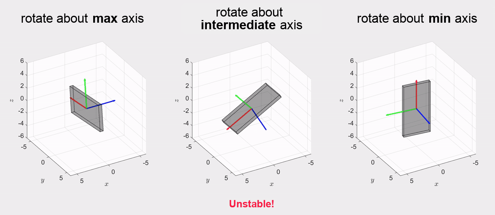

# Torque-Free Motion of a Rigid Body Simulation

## Overview
This GitHub repository contains a collection of MATLAB simulations focusing on the torque-free motion of rigid bodies. The project aims to visualize and demonstrate key concepts in spacecraft dynamics, including rotation about principal axes, behavior of prolate and oblate objects, and dual-spin stabilization.

## Features
- Visualization of rotations about the maximum, intermediate, and minimum principal axes.
- Simulation of torque-free rotation of prolate and oblate objects.
- Illustration of space and body cones showing the rotational behavior of the body.
- Demonstrate the dual-spin stabilization of a spacecraft with a spinning flying wheel.

## Prerequisites
MATLAB. (These files were developed and tested using MATLAB R2023b.)

## Simulations
There are three independent MATLAB files for the simulations:
1. **Principal Axes Theorem:**
   - Simulates the motion of a rigid body rotating about its principal axes.
   - `principal_axes_thm.m`
   - 
   
2. **Prolate vs. Oblate Objects:**
   - Demonstrates the different behaviors of prolate and oblate objects, visualizing the body cone and space cone.
   - `prolate_vs_oblate.m`
   - 
   

3. **Dual-Spin Stabilization:**
   - Simulates the stabilization of a dual-spin spacecraft.
   - `dual_spin_stabilization.m`
   - 
   
## Usage
1. **Clone the repository:**
   ```bash
   git clone https://github.com/yi-hsuan-chen/Torque-Free-Motion-of-a-Rigid-Body-Simulation.git
   ```
2. **Navigate to the project directory:**
   ```bash
   cd Torque-Free-Motion-of-a-Rigid-Body-Simulation
   ```
3. **Open MATLAB and run the desired script:**
  ```matlab
  run('principal_axes_thm.m');
  % run('prolate_vs_oblate.m');
  % run('dual_spin_stabilization.m')
  ```

## Technical Details
For more technical details, please refer to the final project report included in this repository (ENAE646_YiHsuan_Final_Project.pdf).

## Contact
For any questions or further information, please contact: Yi-Hsuan Chen (yhchen91@umd.edu)

## License
This project is licensed under the MIT License - see the [LICENSE](LICENSE) file for details.

## References
1. Kasdin, N. Jeremy, and Derek A. Paley. "Engineering dynamics: a comprehensive introduction." (2011): 1-704.
2. Dual-Spin Spacecraft, Stabilizing Rotation About Any Principal Axis, Dr. Shane Ross. https://www.youtube.com/watch?v=8uOxYf9nLNw
